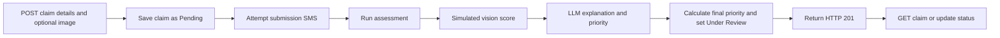

# CropSure AI

<p align="center">
  
</p>
<p align="center">
  <strong>Crop damage claim support for the PM Fasal Bima Yojana use case</strong><br />
  A hackathon prototype for collecting claims, generating an initial assessment, and organizing administrative review.
</p>

<p align="center">
  <a href="#quick-start">Quick start</a> &middot;
  <a href="#api-reference">API reference</a> &middot;
  <a href="#assessment-and-priority">Assessment details</a>
</p>

---

## At a glance

CropSure AI is a Node.js and Express backend with two static HTML mockup pages. The backend accepts crop claim details, optionally stores an uploaded image, completes a prototype assessment before responding, and provides endpoints to review claims and update their status.

The assessment is decision support only. The current vision step does not inspect image pixels, and the HTML pages are not connected to the API. Claims must be submitted and managed through the API until frontend integration is implemented.

<p align="center">
  
</p>

## How a claim moves through the backend



Claim submission waits for assessment to finish before returning HTTP 201. This ensures Vercel does not freeze the function before claim processing completes. Without Twilio credentials, SMS events are written to the backend console.

### Claim status

<p align="center">
  
</p>

The status API accepts any supported status directly; it does not enforce a transition order. Successful AI processing sets the claim to `Under Review`. A separate SMS attempt occurs when the status endpoint is used for `Under Review`, `Approved`, or `Rejected`.

## Quick start

Requirements: Node.js and npm. MongoDB, AI API keys, and Twilio credentials are optional for a local mock-mode demo.

```powershell
git clone https://github.com/rajanithii/AGRI_CLAIM_AI.git
cd AGRI_CLAIM_AI\backend
npm install
Copy-Item .env.example .env
npm start
```

The backend listens on `http://localhost:5000`. Check `http://localhost:5000/api/health` for server status. The checked-in environment example sets `USE_MOCK_AI=true`, so no AI key is needed for the demo.

### Try the claim API

Keep the server terminal open. In a second PowerShell window, check that the API is running:

```powershell
curl.exe http://localhost:5000/api/health
```

Then submit a test claim (the image field is optional):

```powershell
curl.exe -X POST http://localhost:5000/api/claims `
  -F "farmerName=Ramesh" `
  -F "phone=9876543210" `
  -F "cropType=Rice" `
  -F "district=Jalgaon" `
  -F "landArea=5" `
  -F "description=Possible flood damage"
```

The response should have HTTP status `201` and include the assessed claim, normally with status `Under Review` and severity and priority fields. If assessment fails, the claim remains `Pending`. List saved claims with:

```powershell
curl.exe http://localhost:5000/api/claims
```

To upload a photo, add `-F "image=@path\to\crop.jpg"` to the submit command. The upload field is named `image`; accepted types are JPEG, PNG, GIF, and WebP, with a 10 MB local limit and a 4 MB Vercel limit.

To try the page layouts, open `frontend/farmer/index.html` and `frontend/admin/index.html` in a browser. These are static mockups: the farmer button does not submit a claim, and the admin figures and rows are hard-coded examples.

## API reference

Base URL: `http://localhost:5000`

| Method | Endpoint | Behavior |
| --- | --- | --- |
| `POST` | `/api/claims` | Create a claim from multipart form data. Required: `farmerName`, `phone`, `cropType`, `district`, `landArea`. Optional: `description`, `image`. |
| `GET` | `/api/claims` | Return claims with higher `finalPriority` first. |
| `GET` | `/api/claims/:id` | Fetch a claim by MongoDB `_id` or its `claimId`. |
| `PUT` | `/api/claims/:id/status` | Set `status` to `Pending`, `Under Review`, `Approved`, or `Rejected`. Send JSON, for example `{"status":"Approved"}`. |
| `GET` | `/api/health` | Return server status, timestamp, and mock-mode flag. |
| `GET` | `/uploads/<filename>` | Serve an uploaded file. |

There is no authentication or authorization on these endpoints in the current prototype. Status updates for `Under Review`, `Approved`, and `Rejected` trigger an SMS attempt; setting `Pending` does not.

## Assessment and priority

The assessment has two code stages, but only the language-model stage can make a live external AI request:

1. `backend/ai/vision.js` simulates severity. It uses uploaded file size, random variation, a time-based component, and a crop multiplier; it does not analyze image contents. If no image is supplied, the controller assigns a random severity score and a `Medium` damage level.
2. `backend/ai/llm.js` returns templated mock text when mock mode is enabled or no AI key is configured. Otherwise it calls Groq first when `GROQ_API_KEY` is present, or OpenAI when only `OPENAI_API_KEY` is present. Failed live calls fall back to the mock response.
3. The controller combines the severity, LLM priority, and land area into a final score, then updates the claim to `Under Review` when assessment succeeds.

Severity labels are assigned by score: `Low` below 30, `Medium` from 30 to 54, `High` from 55 to 74, and `Critical` at 75 or above. Crop multipliers are configured for 11 crop names in `vision.js`.

```text
Final Priority = round(
    0.5 * Severity Score
  + 0.3 * LLM Priority Score
  + 0.2 * Land Area Weight
)

Land Area Weight = min((acres / 10) * 100, 100)
```

These prototype weights are not calibrated against real claim outcomes. The score and generated explanation are not a field inspection, loss calculation, or insurance decision.

<details>
<summary>AI providers and demo behavior</summary>

| Mode | Behavior |
| --- | --- |
| Mock | Used when `USE_MOCK_AI=true` or when neither AI key is set. The LLM response uses fixed templates with a small random priority variation. |
| Groq | Used when mock mode is off and `GROQ_API_KEY` is set. Model configured in code: `llama3-8b-8192`. |
| OpenAI | Used when mock mode is off, no Groq key is set, and `OPENAI_API_KEY` is set. Model configured in code: `gpt-3.5-turbo`. |

If a live request or response parse fails, the LLM module logs the error and returns a mock assessment.

</details>

## Configuration

Copy `backend/.env.example` to `backend/.env`. Do not commit real credentials.

| Variable | Purpose | Example/default in `.env.example` |
| --- | --- | --- |
| `PORT` | HTTP port | `5000` |
| `MONGODB_URI` | MongoDB connection string | `mongodb://localhost:27017/agriclaim` |
| `USE_MOCK_AI` | Force mock LLM responses | `true` |
| `GROQ_API_KEY` | Optional Groq LLM key | Blank |
| `OPENAI_API_KEY` | Optional OpenAI LLM key | Blank |
| `TWILIO_ACCOUNT_SID` | Optional Twilio account | Blank (SMS logged to console) |
| `TWILIO_AUTH_TOKEN` | Optional Twilio authentication token | Blank (SMS logged to console) |
| `TWILIO_PHONE_NUMBER` | Optional Twilio sender number | Blank (SMS logged to console) |

MongoDB defaults to the local `agriclaim` database. If database operations fail, `ClaimStore` falls back to process memory; those claims are lost when the backend stops. SMS is logged to the backend console unless all three Twilio values are configured with valid credentials. Leave them blank for a local demo; the example values are intentionally empty.

Restart the backend after changing `backend/.env` so it loads the updated configuration.

## Project structure

```text
AGRI_CLAIM_AI/
├── assets/README/
│   ├── hero.svg
│   ├── claim-pipeline.svg
│   └── claim-lifecycle.svg
├── backend/
│   ├── ai/
│   │   ├── llm.js
│   │   └── vision.js
│   ├── controllers/claimsController.js
│   ├── middleware/upload.js
│   ├── models/Claim.js
│   ├── routes/claims.js
│   ├── uploadsDir.js
│   ├── uploads/                 # Runtime uploads; contains .gitkeep
│   ├── .env.example
│   ├── package.json
│   ├── package-lock.json
│   └── server.js
├── frontend/
│   ├── admin/index.html
│   └── farmer/index.html
├── .gitignore
└── README.md
```

The backend owns the npm dependencies and lockfile. The repository-root `package-lock.json` is empty and there is no root `package.json`.

## Deploy on Vercel

Deploy the Express API from the backend directory:

1. Import this repository into Vercel.
2. Set **Root Directory** to `backend`. Vercel's Express zero-configuration support detects `backend/server.js` and installs from `backend/package-lock.json`; no custom `vercel.json` is needed.
3. Use Node.js `22.x`, also specified in `backend/package.json`. Do not set `PORT`; Vercel manages it.
4. Add the environment variables below in the Vercel project settings, then deploy.

| Variable | Required? | Vercel value |
| --- | --- | --- |
| `MONGODB_URI` | Recommended for persistent claims | A reachable hosted MongoDB connection string. Without it, claims use instance-local memory and are not durable or shared. |
| `USE_MOCK_AI` | No | Set to `true` for a demo (recommended); set to `false` to enable a configured live AI provider. |
| `GROQ_API_KEY` | No | Optional; used when set and mock mode is off, and takes precedence over OpenAI. |
| `OPENAI_API_KEY` | No | Optional; used when set, mock mode is off, and Groq is not configured. |
| `TWILIO_ACCOUNT_SID`, `TWILIO_AUTH_TOKEN`, `TWILIO_PHONE_NUMBER` | No | Optional; set all three valid values to send SMS. Otherwise SMS is logged as a mock. |

Verify the deployment at `https://<your-deployment>/` and `https://<your-deployment>/api/health`. The root returns API status and endpoint links. MongoDB connections are cached across warm invocations and use short connection timeouts. Assessment is awaited before the claim endpoint responds so serverless execution cannot be frozen mid-assessment.

Vercel function request bodies are limited to 4.5 MB, so image uploads are capped at 4 MB on Vercel (10 MB locally). Vercel uploads use temporary `/tmp` storage and may disappear between invocations or instances; use external object storage for durable images. The `frontend/` pages are static mockups and are not part of this backend-root deployment.

For a deployed claim smoke test, use the `claimId` returned by the POST response in the final GET:

```powershell
curl.exe https://<your-deployment>/
curl.exe https://<your-deployment>/api/health
curl.exe -X POST https://<your-deployment>/api/claims -F "farmerName=Ramesh" -F "phone=9876543210" -F "cropType=Rice" -F "district=Jalgaon" -F "landArea=5" -F "description=Possible flood damage"
curl.exe https://<your-deployment>/api/claims/<claimId>
```

## Current limitations

- The vision score is simulated and does not inspect the submitted photo.
- The farmer and admin pages are not connected to the API; the admin data is illustrative, not live.
- The API has no authentication or authorization.
- Uploaded images are served publicly; Vercel stores them temporarily and does not provide durable image storage.
- MongoDB fallback data is in memory and does not persist across restarts.
- Priority weights and mock assessments are for demonstration only, not validated insurance decisions.
